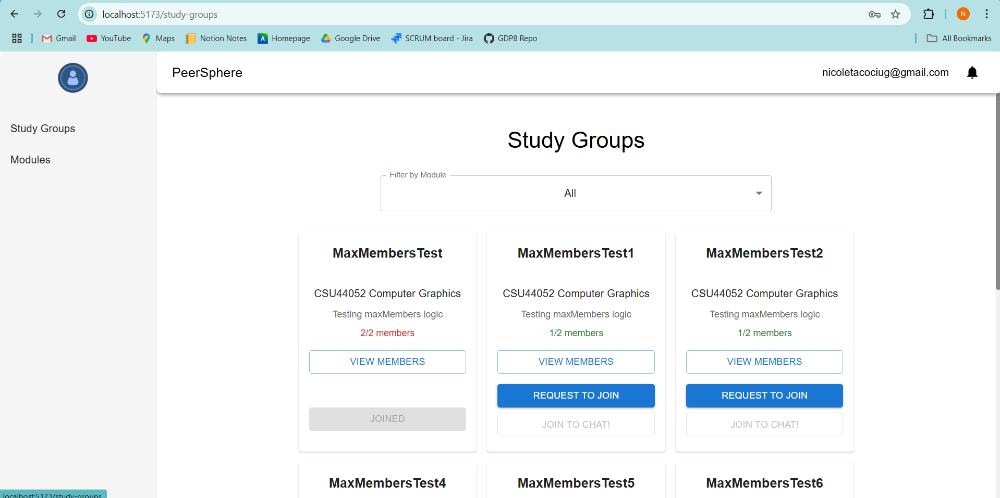
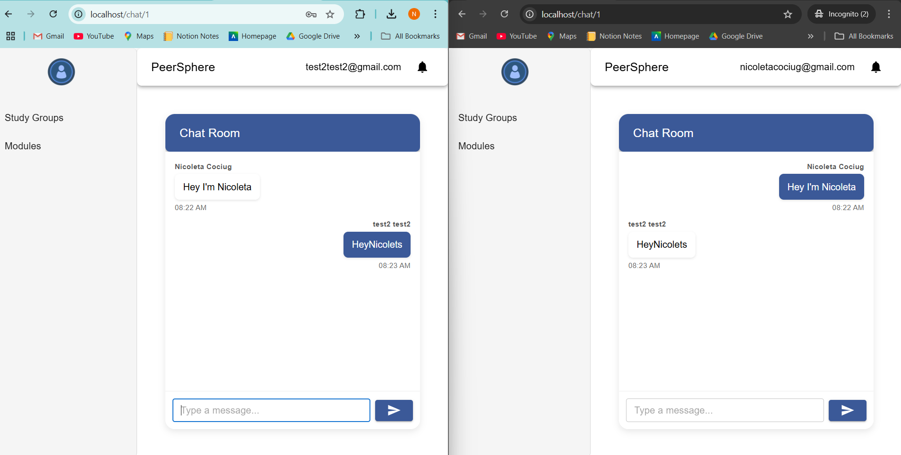

# PeerSphere - Group 8 - CSU44098 Group Design Project (2024/25)

## Overview

PeerSphere is an online platform designed to help students find study groups based on their academic modules. This enables users to connect with peers, collaborate on academic projects, and improve their learning experience.

### Key Features

- **Module-Based Study Groups:** Enables students to find and join study groups based on their save module prefernces.
- **Real-time Communication:** Users can chat instantly with study group members via an online chat (implemented using WebSockets to facilitate low-latency, bidirectional messaging).
- **Secure Authentication:** Leverages Firebase Authentication for OAuth-based user identity management, ensuring seamless and secure user login.
- **Robust Backend:** Developed in Go, utilising a MySQL database for structured and efficient data management, with Docker containerisation ensuring consistent and scalable deployment.
- **Modular Architecture:** The backend implementation follows scalable design patterns with well-defined module boundaries to enhance efficiency and maintainability.
- **Continuous Integration:** A CI Pipeline automates testing and static code analysis, ensuring high code quality and streamlined releases.

## Step by Step

TLDR: to run the app locally it is enough to run `./scripts/run-localprod` from the main project directory. Details are provided below.

The app server can be easily run using the scripts provided in the `scripts` directory.

For authentication, the server relies on Firebase, which affects how it can be run locally and in production. To support both scenarios, two run scripts are provided: `run-localprod` and `run-prod`. The `localprod` script uses a Firebase emulator, allowing the server to run entirely locally without requiring real Firebase credentials. Conversely, the `prod` script connects to the actual Firebase services, requiring valid Firebase credentials to be configured.

In order to run the app in `localprod` mode it is enough to run `./scripts/run-localprod` from the main project directory. The script will then run all the necessary services and expose the web-based frontend on port `80`. The app can then be accessed through the browser by navigating to `localhost`.

Similarly, the app can be run in `prod` mode by running `./scripts/run-prod` from the main project directory. Since it requires connection to the actual Firebase service, however, it is also needed to provide Firebase credentials files. A `serviceAccountKey.json` file must be placed in `backend/credentials` directory. The environmental variables (as specified in the `frontend/src/auth/firebase.tsx`) must also be defined in a `.env.production` file placed in the `frontend-web` directory. With the credentials files in place, the script will similarly run all the necessary services and expose the web-based frontend on port `80`. The app can then be accessed through the browser by navigating to `localhost`.

Docker compose is needed to run the application using the provided scripts.

Additional scripts are also provided for running the backend in `dev` mode (`./scripts/run-dev`), as well as for executing integration tests (`./scripts/run-tests-integration`).

## Backends

The application backend utilises a MySQL database and Firebase for authentication. If the app is run using the provided scripts, any ports for backend services used will also be exposed by default:

- the main backend server (REST and WebSocket API) can be accessed on port `8080`;
- the Firebase emulator (if used) can be accessed on port `4000` (emulator UI) and `9099` (auth emulator).
